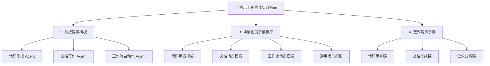

# 提示工程体系设计方案

## 整体架构



## 交付物结构

在工作区根目录创建 `prompt-engineering/` 目录，包含以下文件：

```
prompt-engineering/
├── README.md                          # 总览与使用说明
├── 01-guide.md                        # 提示工程最佳实践指南
├── 02-system-prompts/                 # 系统提示模板
│   ├── code-generation.md             # 代码生成 Agent 系统提示
│   ├── doc-writing.md                 # 文档写作 Agent 系统提示
│   └── workflow-automation.md         # 工作流自动化 Agent 系统提示
├── 03-templates/                      # 场景化提示模板库
│   ├── code/                          # 代码相关模板
│   │   ├── generate-component.md      # 生成组件
│   │   ├── code-review.md             # 代码审查
│   │   ├── refactor.md                # 重构建议
│   │   ├── debug.md                   # 调试辅助
│   │   └── test-generation.md         # 测试生成
│   ├── doc/                           # 文档相关模板
│   │   ├── technical-doc.md           # 技术文档
│   │   ├── api-doc.md                 # API 文档
│   │   ├── changelog.md              # 变更日志
│   │   └── tutorial.md                # 教程写作
│   ├── workflow/                      # 工作流相关模板
│   │   ├── requirement-analysis.md    # 需求分析
│   │   ├── architecture-design.md     # 架构设计
│   │   └── task-decomposition.md      # 任务分解
│   └── general/                       # 通用模板
│       ├── summarize.md               # 摘要提取
│       ├── translate.md               # 翻译
│       ├── structured-output.md       # 结构化输出
│       └── few-shot-template.md       # 少样本学习模板
└── 04-chains/                         # 链式提示示例
    ├── code-review-chain.md           # 代码审查流水线
    ├── doc-generation-chain.md        # 文档生成流水线
    └── feature-development-chain.md   # 功能开发流水线
```

## 各部分核心内容

### 1. 提示工程最佳实践指南 (`01-guide.md`)

核心方法论，包含：

- **CRAFT 框架**：Context（上下文）、Role（角色）、Action（动作）、Format（格式）、Tone（语气）
- **提示结构黄金法则**：角色设定 -> 任务描述 -> 约束条件 -> 输出格式 -> 示例
- **多模型适配技巧**：Claude 偏好 XML 标签结构化、GPT 偏好 Markdown 和 JSON、Gemini 偏好自然语言
- **常见反模式与修复**：模糊指令、过度约束、缺少示例等
- **提示调试方法论**：迭代优化的系统方法
- **少样本学习设计原则**：示例选择、数量、格式

### 2. 系统提示模板 (`02-system-prompts/`)

每个系统提示包含：

- 角色定义与专业领域边界
- 行为准则与约束
- 输出格式规范
- 错误处理策略
- 多模型适配注释（标注哪些部分需要按模型调整）

### 3. 场景化提示模板库 (`03-templates/`)

每个模板统一格式：

- **场景描述**：何时使用
- **变量占位符**：用 `{{variable}}` 标记可替换部分
- **提示正文**：经过优化的提示文本
- **使用示例**：填充变量后的完整示例
- **预期输出示例**：展示理想输出
- **调优建议**：针对不同模型的微调提示

### 4. 链式提示示例 (`04-chains/`)

每条链包含：

- 流程图（Mermaid）
- 各步骤的提示模板
- 步骤间的数据传递格式
- 完整的端到端示例

## 设计原则

- **模块化**：每个模板独立可用，也可组合使用
- **参数化**：通过 `{{变量}}` 占位符实现复用
- **多模型兼容**：标注模型差异，提供适配建议
- **渐进式**：从简单到复杂，从单提示到链式
- **实战导向**：每个模板附带真实使用示例
