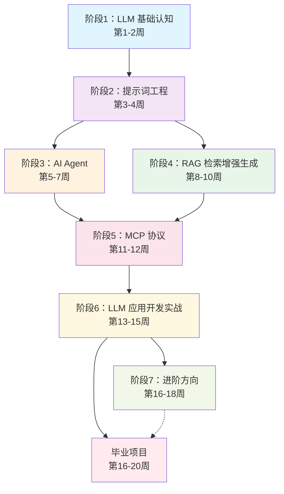

# LLM 大模型全栈学习计划

> 适用对象：有 2 年以上编程经验的互联网从业者  
> 学习节奏：每天 1-2 小时，总计约 18 周  
> 目标：能独立开发 LLM 驱动的应用产品

---

## 一、学习路线总览



**依赖关系说明：**

| 关系 | 说明 |
|------|------|
| 阶段1 → 阶段2 | 必须先理解 LLM 基本原理，才能写好提示词 |
| 阶段2 → 阶段3/4 | 提示词工程是 Agent 和 RAG 的基础，之后 Agent 和 RAG 可并行学习 |
| 阶段3+4 → 阶段5 | MCP 是连接 Agent 与外部工具的协议，需要先理解 Agent 和 RAG |
| 阶段5 → 阶段6 | 综合实战需要前面所有知识 |
| 阶段6 → 阶段7/毕业项目 | 进阶方向和毕业项目可并行推进 |

---

## 二、文件目录

| 文件 | 内容 |
|------|------|
| [01-llm-fundamentals](./01-llm-fundamentals/index.md) | 阶段1：LLM 基础认知（第1-2周） |
| [02-prompt-engineering](./02-prompt-engineering/index.md) | 阶段2：提示词工程（第3-4周） |
| [03-ai-agent](./03-ai-agent/index.md) | 阶段3：AI Agent（第5-7周） |
| [04-rag](./04-rag/index.md) | 阶段4：RAG 检索增强生成（第8-10周） |
| [05-mcp](./05-mcp/index.md) | 阶段5：MCP 协议（第11-12周） |
| [06-llm-app-dev](./06-llm-app-dev/index.md) | 阶段6：LLM 应用开发实战（第13-15周） |
| [07-advanced](./07-advanced/index.md) | 阶段7：进阶方向（第16-18周） |
| [08-resources-and-graduation](./08-resources-and-graduation/index.md) | 资源汇总 + 毕业项目 + 学习建议 |
| [mcp-quickstart-typescript.md](./mcp-quickstart-typescript.md) | MCP Server 快速搭建详解（TypeScript 版） |
| [mcp-quickstart-python.md](./mcp-quickstart-python.md) | MCP Server 快速搭建详解（Python 版） |

---

## 三、环境准备清单

在正式开始学习前，请完成以下准备：

### 账号注册

- [ ] OpenAI 账号（用于 GPT API）
- [ ] Anthropic 账号（用于 Claude API）
- [ ] GitHub 账号（代码托管、开源项目参考）
- [ ] Hugging Face 账号（模型下载、Spaces 体验）

### 开发环境

- [ ] Python 3.10+（推荐用 pyenv 或 conda 管理版本）
- [ ] Node.js 18+（MCP 开发需要）
- [ ] VS Code 或 Cursor IDE
- [ ] Git

### 推荐 VS Code / Cursor 插件

- Python（Microsoft）
- Jupyter
- REST Client（API 调试）
- Markdown Preview Mermaid Support

### API Key 预算参考

| 服务 | 用途 | 学习期间预估费用 |
|------|------|-----------------|
| OpenAI API | GPT-4o 调用 | $10-20 |
| Anthropic API | Claude 调用 | $10-20 |
| Pinecone / Qdrant | 向量数据库（RAG 阶段） | 免费额度足够 |
| 各类免费模型 | Ollama 本地运行 | $0 |

> 💡 **省钱提示**：学习阶段优先使用 Ollama 运行本地模型（如 Llama 3、Qwen 2.5），只在必要时调用付费 API。

---

## 四、学习节奏建议

```
周一至周五：每天 1-1.5 小时，学习新知识 + 动手练习
周六：2 小时，做阶段项目
周日：休息或自由探索
```

**现在就从 [阶段 1：LLM 基础认知](./01-llm-fundamentals/index.md) 开始吧！**
