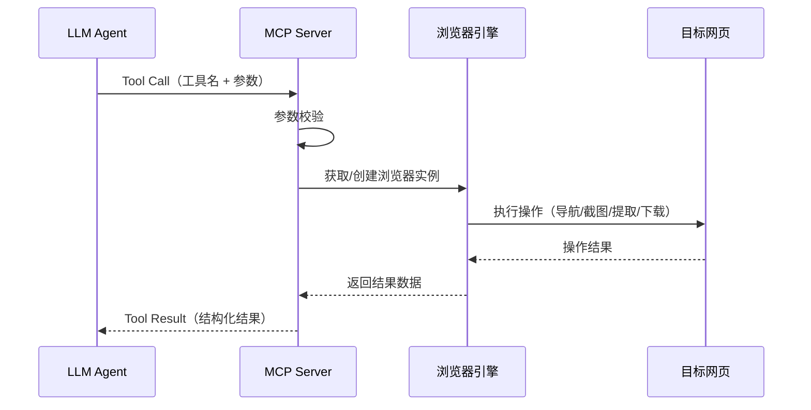

# 浏览器自动化操作 MCP 产品需求文档（PRD）

## 文档信息

| 字段 | 内容 |
|------|------|
| 文档版本 | v1.0 |
| 创建日期 | 2026-03-03 |
| 文档状态 | 草稿 |
| 目标读者 | 产品、设计、前端、后端、测试 |

## 1. 背景与目标

### 1.1 项目背景

在日常数据分析工作中，团队成员需要频繁访问各类数据平台（如内部 BI 看板、数据监控平台等），执行重复性的操作：查看趋势图、截取关键表格、下载报表数据。这些操作流程固定但耗时，且人工操作容易遗漏或出错。

与此同时，大语言模型（LLM）在智能助手、自动化工作流等场景中的应用日益广泛。LLM 擅长理解自然语言指令并编排任务，但缺乏直接与浏览器界面交互的能力。当前 LLM 生态中，MCP（Model Context Protocol）作为标准化的工具调用协议，为 LLM 提供了统一的外部能力扩展方式。

因此，需要构建一个基于 MCP 协议的浏览器自动化操作服务，让 LLM 能够通过标准化接口驱动浏览器完成数据平台上的固定操作，实现「自然语言指令 → 浏览器自动执行 → 结果回传」的闭环。

### 1.2 项目目标

1. **能力交付**：提供一个符合 MCP 协议规范的 Python 服务，支持 LLM 通过标准 Tool Call 驱动浏览器执行预定义操作
2. **核心场景覆盖**：支持至少 3 类核心操作——页面导航、元素截图、数据下载，覆盖数据平台的典型使用场景
3. **响应效率**：单次浏览器操作（导航 + 截图/下载）端到端耗时 < 15 秒（网络正常情况下）
4. **可扩展性**：操作动作采用插件化设计，新增一个操作动作的开发量 < 0.5 天
5. **稳定性**：服务连续运行 24 小时无崩溃，单次操作失败自动重试，成功率 > 95%

### 1.3 目标用户

| 角色 | 描述 | 核心诉求 |
|------|------|---------|
| LLM Agent | 通过 MCP 协议调用本服务的大语言模型代理 | 标准化的工具接口、清晰的参数定义、结构化的返回结果 |
| Agent 开发者 | 构建 LLM Agent 工作流的开发人员 | 易于集成、文档完善、调试方便、错误信息明确 |
| 运维人员 | 负责部署和维护 MCP 服务的技术人员 | 部署简单、日志完整、配置灵活、资源占用可控 |

## 2. 需求概述

### 2.1 功能全景图

| 功能模块 | 功能点 | 优先级 | 简要说明 |
|----------|--------|--------|----------|
| MCP 服务框架 | MCP Server 启动与通信 | P0 | 基于 MCP SDK 实现标准 Server，支持 stdio/SSE 传输 |
| MCP 服务框架 | Tool 注册与路由 | P0 | 将浏览器操作注册为 MCP Tool，自动生成参数 Schema |
| 浏览器引擎 | 浏览器实例管理 | P0 | 管理浏览器启动、复用、关闭的生命周期 |
| 浏览器引擎 | 页面导航 | P0 | 打开指定 URL，等待页面加载完成 |
| 浏览器引擎 | 元素定位 | P0 | 通过 CSS 选择器、XPath 或文本内容定位页面元素 |
| 操作能力 | 页面/元素截图 | P0 | 对整个页面或指定元素进行截图，返回图片数据 |
| 操作能力 | 表格数据提取 | P0 | 识别并提取页面中的表格数据，返回结构化数据 |
| 操作能力 | 文件下载 | P1 | 触发页面上的下载按钮，获取下载文件并返回文件路径 |
| 操作能力 | 点击操作 | P1 | 点击指定元素（按钮、链接、菜单项等） |
| 操作能力 | 表单填写 | P1 | 向输入框、下拉框等表单元素填入指定值 |
| 操作能力 | 页面滚动 | P2 | 滚动到指定位置或指定元素可见 |
| 操作能力 | 等待条件 | P1 | 等待指定元素出现、消失或页面达到某种状态 |
| 会话管理 | Cookie/登录态管理 | P1 | 支持注入 Cookie 或复用已登录的浏览器 Profile |
| 会话管理 | 多标签页管理 | P2 | 支持打开多个标签页并在标签页间切换 |
| 辅助能力 | 操作日志记录 | P1 | 记录每次操作的详细日志，便于排查问题 |
| 辅助能力 | 错误处理与重试 | P1 | 操作失败时自动重试，返回明确的错误信息 |
| 辅助能力 | 操作超时控制 | P1 | 每个操作可配置超时时间，超时自动终止并返回错误 |
| 配置管理 | 服务配置 | P1 | 支持通过配置文件或环境变量配置浏览器路径、超时时间等 |
| 配置管理 | 预定义操作流（建议新增） | P2 | 将多个原子操作编排为一个复合操作流，一次调用完成多步操作 |

### 2.2 核心流程

**主流程：LLM 调用 MCP Tool 执行浏览器操作**

**典型场景流程：截取数据平台表格截图**

1. LLM 发送 `navigate` 指令 → MCP 驱动浏览器打开数据平台 URL
2. LLM 发送 `wait_for_element` 指令 → 等待表格加载完成
3. LLM 发送 `screenshot` 指令（指定表格标题文本定位） → 截取表格区域截图
4. MCP 返回 base64 编码的图片数据 → LLM 可直接用于多模态分析

**典型场景流程：下载数据平台表格数据**

1. LLM 发送 `navigate` 指令 → 打开数据平台 URL
2. LLM 发送 `click` 指令 → 点击「导出」按钮
3. LLM 发送 `wait_for_download` 指令 → 等待文件下载完成
4. MCP 返回下载文件的本地路径 → LLM 可后续读取文件内容

## 3. 功能详细描述

### 3.1 MCP 服务框架

#### 功能说明

MCP 服务框架是整个系统的骨架。它负责启动一个符合 MCP 协议的 Server 进程，接收来自 LLM 的工具调用请求，将请求路由到对应的浏览器操作处理函数，并将执行结果按 MCP 协议格式返回给 LLM。简单来说，它是 LLM 和浏览器之间的「翻译官」。

#### 用户故事

- 作为【Agent 开发者】，我希望【通过标准 MCP 配置即可接入浏览器操作能力】，以便【无需了解浏览器自动化细节就能在 Agent 中使用】
- 作为【Agent 开发者】，我希望【每个 Tool 都有清晰的参数 Schema 和描述】，以便【LLM 能准确理解何时以及如何调用这些工具】

#### 功能规则

1. **服务启动**
   - 触发条件：运行 `python -m browser_mcp` 或通过 MCP 客户端配置启动
   - 处理逻辑：初始化 MCP Server，注册所有 Tool，启动传输层监听
   - 异常处理：端口被占用时提示明确错误信息；依赖缺失时列出缺失项

2. **传输协议支持**
   - 触发条件：根据启动参数选择传输方式
   - 处理逻辑：支持 stdio（标准输入输出，适用于本地 Agent）和 SSE（Server-Sent Events，适用于远程调用）两种模式
   - 异常处理：不支持的传输模式返回明确错误

3. **Tool 自动注册**
   - 触发条件：服务启动时
   - 处理逻辑：扫描所有已实现的操作函数，自动注册为 MCP Tool，基于函数签名和类型注解生成 JSON Schema
   - 异常处理：注册失败的 Tool 记录日志但不阻塞服务启动

#### 界面要求

本模块无用户界面。对外暴露的是 MCP 协议接口，需确保：
- 每个 Tool 的 `name` 采用 `snake_case` 命名，语义清晰（如 `navigate_to_url`、`take_screenshot`）
- 每个 Tool 的 `description` 用一句话说明用途，便于 LLM 理解
- 参数的 `description` 包含示例值

#### 验收标准

- **Given** MCP Server 已启动且运行正常
  **When** LLM 客户端发送 `tools/list` 请求
  **Then** 返回所有已注册 Tool 的列表，每个 Tool 包含 name、description、inputSchema

- **Given** MCP Server 已启动
  **When** LLM 发送一个合法的 Tool Call 请求
  **Then** Server 在 1 秒内开始处理（不含浏览器操作时间），并返回符合 MCP 协议的 Tool Result

- **Given** MCP Server 已启动
  **When** LLM 发送一个参数不合法的 Tool Call 请求
  **Then** 返回包含明确错误描述的 error 响应，不导致服务崩溃

### 3.2 浏览器引擎管理

#### 功能说明

浏览器引擎管理模块负责控制浏览器的生命周期——什么时候启动浏览器、什么时候复用已有的浏览器、什么时候关闭浏览器。它就像一个「浏览器管家」，确保每次操作都有可用的浏览器，同时避免开启过多浏览器浪费系统资源。底层基于 Playwright 实现。

#### 用户故事

- 作为【LLM Agent】，我希望【不需要手动管理浏览器的启动和关闭】，以便【专注于业务操作逻辑】
- 作为【运维人员】，我希望【浏览器实例数量可控】，以便【服务器资源不被耗尽】

#### 功能规则

1. **浏览器实例创建**
   - 触发条件：收到操作请求且当前无可用浏览器实例
   - 处理逻辑：使用 Playwright 启动 Chromium 浏览器，支持 headless（无界面）和 headed（有界面）两种模式
   - 异常处理：启动失败时重试 1 次，仍失败则返回错误信息

2. **浏览器实例复用**
   - 触发条件：收到操作请求且已有空闲浏览器实例
   - 处理逻辑：复用已有实例，避免重复启动的开销
   - 异常处理：若已有实例不可用（已崩溃），自动创建新实例

3. **浏览器实例回收**
   - 触发条件：浏览器空闲超过配置时间（默认 5 分钟）或服务关闭
   - 处理逻辑：优雅关闭浏览器进程，释放资源
   - 异常处理：关闭超时则强制终止进程

4. **并发控制**
   - 触发条件：同时收到多个操作请求
   - 处理逻辑：最大浏览器实例数可配置（默认 3），超出时排队等待
   - 异常处理：排队超时（默认 30 秒）返回「服务繁忙」错误

#### 界面要求

无用户界面。通过配置项控制行为：
- `browser.headless`：是否使用无界面模式（默认 true）
- `browser.max_instances`：最大实例数（默认 3）
- `browser.idle_timeout`：空闲回收时间（默认 300 秒）
- `browser.executable_path`：自定义浏览器路径（可选）

#### 验收标准

- **Given** 服务刚启动，无浏览器实例
  **When** 收到第一个操作请求
  **Then** 在 5 秒内启动浏览器实例并开始执行操作

- **Given** 已有一个空闲浏览器实例
  **When** 收到新的操作请求
  **Then** 复用已有实例，无需等待浏览器启动时间

- **Given** 浏览器实例空闲超过配置的超时时间
  **When** 超时定时器触发
  **Then** 浏览器实例被关闭，系统资源被释放

### 3.3 页面导航

#### 功能说明

页面导航是最基础的操作——告诉浏览器「打开某个网址」。它会打开指定的 URL，等待页面加载完成后返回页面的基本信息（标题、URL 等），让 LLM 知道当前页面的状态。

#### 用户故事

- 作为【LLM Agent】，我希望【通过提供 URL 就能打开目标页面】，以便【后续在该页面上执行截图、数据提取等操作】

#### 功能规则

1. **基本导航**
   - 触发条件：LLM 调用 `navigate` Tool 并传入 URL
   - 处理逻辑：浏览器打开 URL，等待页面 `load` 事件触发或达到 `networkidle` 状态
   - 异常处理：URL 格式非法返回参数错误；页面加载超时（默认 30 秒）返回超时错误

2. **等待策略**
   - 触发条件：页面开始加载
   - 处理逻辑：支持多种等待策略——`load`（DOM 加载完成）、`networkidle`（网络空闲）、`domcontentloaded`（DOM 解析完成）
   - 异常处理：等待超时后返回当前页面状态，标注「页面可能未完全加载」

#### 界面要求

Tool 参数定义：
- `url`（string，必填）：目标页面 URL
- `wait_until`（string，选填，默认 `networkidle`）：等待策略
- `timeout`（number，选填，默认 30000）：超时时间（毫秒）

返回结果：
- `title`：页面标题
- `url`：最终 URL（可能经过重定向）
- `status`：HTTP 状态码

#### 验收标准

- **Given** 浏览器实例已就绪
  **When** 调用 `navigate` 传入一个有效 URL
  **Then** 页面加载完成后返回页面标题和最终 URL，耗时 < 10 秒（正常网络）

- **Given** 浏览器实例已就绪
  **When** 调用 `navigate` 传入一个无法访问的 URL
  **Then** 在超时后返回明确的错误信息，包含错误类型（超时/DNS 解析失败/连接拒绝等）

### 3.4 元素定位与截图

#### 功能说明

这个功能让 LLM 能够「看到」页面上的内容。LLM 可以通过表格标题文本、CSS 选择器等方式找到页面上的特定区域，然后对该区域进行截图。截图结果以图片数据的形式返回，LLM 可以直接用于多模态分析（比如看懂图表中的趋势）。

#### 用户故事

- 作为【LLM Agent】，我希望【通过表格标题文本定位到对应表格并截图】，以便【将截图用于数据分析或汇报】
- 作为【LLM Agent】，我希望【对整个页面进行全屏截图】，以便【获取页面的整体视觉信息】

#### 功能规则

1. **元素定位**
   - 触发条件：LLM 调用截图/操作 Tool 并传入定位参数
   - 处理逻辑：支持以下定位方式（按优先级）：
     - `text`：通过可见文本内容匹配（如表格标题）
     - `selector`：通过 CSS 选择器匹配
     - `xpath`：通过 XPath 表达式匹配
   - 异常处理：找不到元素时返回错误，包含「页面上可见的相似文本」辅助 LLM 修正

2. **元素截图**
   - 触发条件：元素定位成功后
   - 处理逻辑：对定位到的元素进行截图，支持配置是否包含元素周围的上下文区域（padding）
   - 异常处理：元素不可见（被遮挡或尺寸为 0）时返回错误提示

3. **全页截图**
   - 触发条件：LLM 调用截图 Tool 且未指定定位参数
   - 处理逻辑：对当前视口（viewport）或整个页面（full page）进行截图
   - 异常处理：页面过长（> 10000px）时自动截取视口范围并提示

#### 界面要求

Tool 参数定义：
- `locator`（object，选填）：元素定位器
  - `type`（string）：定位方式，枚举值 `text` / `selector` / `xpath`
  - `value`（string）：定位值
- `full_page`（boolean，选填，默认 false）：是否截取整个页面
- `padding`（number，选填，默认 0）：元素截图时的外边距（像素）
- `format`（string，选填，默认 `png`）：图片格式，`png` 或 `jpeg`

返回结果：
- `image`：base64 编码的图片数据
- `mime_type`：图片 MIME 类型
- `width` / `height`：图片尺寸
- `element_text`：被截图元素的文本内容（辅助 LLM 确认截图目标）

#### 验收标准

- **Given** 页面已加载，页面上存在标题为「日活跃用户趋势」的表格
  **When** 调用 `screenshot` 传入 `locator: {type: "text", value: "日活跃用户趋势"}`
  **Then** 返回包含该表格区域的截图，图片数据有效且可正常显示

- **Given** 页面已加载
  **When** 调用 `screenshot` 传入一个页面上不存在的文本
  **Then** 返回错误信息，并附带页面上可见的相似文本列表

- **Given** 页面已加载
  **When** 调用 `screenshot` 不传入 locator，`full_page` 设为 true
  **Then** 返回整个页面的完整截图

### 3.5 表格数据提取

#### 功能说明

这个功能让 LLM 能够「读取」页面上表格里的数据。它会找到页面中的 HTML 表格，把表头和每一行数据提取出来，转换成结构化的 JSON 格式返回。这样 LLM 就可以直接对数据进行分析、汇总或转发，而不需要通过截图再做 OCR 识别。

#### 用户故事

- 作为【LLM Agent】，我希望【直接获取页面表格中的结构化数据】，以便【对数据进行计算、对比、生成报告等操作】
- 作为【LLM Agent】，我希望【通过表格标题定位到特定表格并提取数据】，以便【在多个表格的页面中精确获取目标数据】

#### 功能规则

1. **表格识别**
   - 触发条件：LLM 调用 `extract_table` Tool
   - 处理逻辑：定位页面中的 `<table>` 元素，提取 `<thead>` 和 `<tbody>` 中的数据；同时支持识别基于 `
` 构建的虚拟表格（通过 `role="grid"` 等 ARIA 属性识别）
   - 异常处理：未找到表格时返回空数组并提示

2. **数据结构化**
   - 触发条件：表格识别成功
   - 处理逻辑：将表格转换为 JSON 数组，每行为一个对象，key 为表头文本，value 为单元格文本
   - 异常处理：表头缺失时使用 `column_1`、`column_2` 等自动命名

3. **表格定位**
   - 触发条件：传入了 locator 参数
   - 处理逻辑：先定位到指定元素，再在其附近查找最近的表格
   - 异常处理：定位到的元素附近无表格时返回错误

#### 界面要求

Tool 参数定义：
- `locator`（object，选填）：表格定位器（同 3.4 元素定位）
- `max_rows`（number，选填，默认 100）：最大提取行数
- `include_header`（boolean，选填，默认 true）：是否包含表头

返回结果：
- `headers`：表头数组
- `rows`：数据行数组（每行为 key-value 对象）
- `total_rows`：表格实际总行数
- `extracted_rows`：本次提取的行数

#### 验收标准

- **Given** 页面包含一个标准 HTML 表格，有 3 列 10 行数据
  **When** 调用 `extract_table`
  **Then** 返回包含 10 行数据的 JSON 数组，每行有 3 个字段，字段名与表头一致

- **Given** 页面包含多个表格
  **When** 调用 `extract_table` 并传入某个表格标题的 text locator
  **Then** 仅返回该标题对应表格的数据

- **Given** 页面表格有 500 行数据
  **When** 调用 `extract_table` 且 `max_rows` 设为 50
  **Then** 返回前 50 行数据，`total_rows` 显示 500，`extracted_rows` 显示 50

### 3.6 文件下载

#### 功能说明

这个功能让 LLM 能够触发页面上的下载操作（比如点击「导出 Excel」按钮），等待文件下载完成，然后把下载好的文件路径告诉 LLM。LLM 后续可以通过文件系统工具读取这个文件的内容。

#### 用户故事

- 作为【LLM Agent】，我希望【点击页面上的导出按钮并获取下载文件】，以便【将数据文件用于后续的分析处理流程】

#### 功能规则

1. **触发下载**
   - 触发条件：LLM 调用 `download_file` Tool
   - 处理逻辑：定位并点击指定的下载按钮/链接，监听浏览器的下载事件
   - 异常处理：点击后 10 秒内未触发下载事件，返回「未检测到下载」错误

2. **等待下载完成**
   - 触发条件：下载事件触发后
   - 处理逻辑：监控下载进度，等待文件写入完成
   - 异常处理：下载超时（默认 60 秒）返回错误；下载失败返回浏览器报告的错误原因

3. **文件存储**
   - 触发条件：下载完成
   - 处理逻辑：将文件保存到配置的下载目录（默认 `./downloads/`），文件名保留原始名称，重名时自动添加时间戳后缀
   - 异常处理：磁盘空间不足时返回错误

#### 界面要求

Tool 参数定义：
- `locator`（object，必填）：下载按钮/链接的定位器
- `save_dir`（string，选填）：自定义保存目录
- `timeout`（number，选填，默认 60000）：下载超时时间（毫秒）

返回结果：
- `file_path`：下载文件的完整路径
- `file_name`：文件名
- `file_size`：文件大小（字节）
- `mime_type`：文件 MIME 类型

#### 验收标准

- **Given** 页面上有一个「导出 CSV」按钮
  **When** 调用 `download_file` 传入该按钮的 locator
  **Then** 文件下载完成后返回文件路径，文件可正常打开且内容与页面数据一致

- **Given** 页面上的下载按钮需要先选择导出格式
  **When** 调用 `download_file` 但下载未触发
  **Then** 在超时后返回明确的错误信息「未检测到下载事件」

### 3.7 点击与表单操作

#### 功能说明

这是一组基础交互操作，让 LLM 能够像人一样「点击按钮」和「填写表单」。比如点击筛选条件、选择日期范围、输入搜索关键词等。这些操作通常是执行截图或下载之前的准备步骤。

#### 用户故事

- 作为【LLM Agent】，我希望【点击页面上的筛选按钮并选择条件】，以便【在截图或下载前先筛选出目标数据】
- 作为【LLM Agent】，我希望【在搜索框中输入关键词】，以便【定位到特定的数据记录】

#### 功能规则

1. **点击操作**
   - 触发条件：LLM 调用 `click` Tool
   - 处理逻辑：定位元素 → 滚动到元素可见 → 执行点击
   - 异常处理：元素被遮挡时尝试滚动后重试；元素不可点击时返回错误

2. **文本输入**
   - 触发条件：LLM 调用 `fill` Tool
   - 处理逻辑：定位输入框 → 清空已有内容 → 输入新内容
   - 异常处理：元素不是可输入类型时返回错误

3. **下拉选择**
   - 触发条件：LLM 调用 `select` Tool
   - 处理逻辑：定位下拉框 → 展开选项 → 选择匹配的选项
   - 异常处理：指定选项不存在时返回可用选项列表

#### 界面要求

`click` Tool 参数：
- `locator`（object，必填）：目标元素定位器

`fill` Tool 参数：
- `locator`（object，必填）：输入框定位器
- `value`（string，必填）：要输入的文本

`select` Tool 参数：
- `locator`（object，必填）：下拉框定位器
- `value`（string，必填）：要选择的选项文本

所有操作统一返回：
- `success`：是否成功
- `message`：操作结果描述

#### 验收标准

- **Given** 页面上有一个「查询」按钮
  **When** 调用 `click` 传入该按钮的 text locator
  **Then** 按钮被成功点击，返回 `success: true`

- **Given** 页面上有一个搜索输入框
  **When** 调用 `fill` 传入输入框 locator 和搜索文本
  **Then** 输入框中显示输入的文本，返回 `success: true`

- **Given** 页面上有一个日期范围下拉框
  **When** 调用 `select` 传入一个不存在的选项值
  **Then** 返回 `success: false`，并附带当前可用的选项列表

### 3.8 Cookie 与登录态管理

#### 功能说明

大多数数据平台需要登录才能访问。这个功能让 LLM 能够为浏览器设置登录凭证（Cookie），或者直接复用一个已经登录过的浏览器配置文件（Profile），从而跳过登录流程直接访问需要权限的页面。

#### 用户故事

- 作为【Agent 开发者】，我希望【通过注入 Cookie 让浏览器保持登录状态】，以便【MCP 可以访问需要登录的数据平台】
- 作为【Agent 开发者】，我希望【复用本地浏览器的登录态】，以便【不需要在配置中存储敏感的登录凭证】

#### 功能规则

1. **Cookie 注入**
   - 触发条件：LLM 调用 `set_cookies` Tool 或在配置文件中预设 Cookie
   - 处理逻辑：将 Cookie 注入到浏览器上下文中，后续所有请求自动携带
   - 异常处理：Cookie 格式非法时返回格式要求说明

2. **浏览器 Profile 复用**
   - 触发条件：配置文件中指定了 `browser.user_data_dir`
   - 处理逻辑：启动浏览器时加载指定的用户数据目录，复用其中的登录态、Cookie 等
   - 异常处理：目录不存在或无权限时返回错误

3. **登录态检测**
   - 触发条件：导航到需要登录的页面后
   - 处理逻辑：检查页面是否被重定向到登录页（通过 URL 模式匹配），如果是则返回「登录态已失效」的提示
   - 异常处理：无法判断时不做处理，由 LLM 根据页面内容自行判断

#### 界面要求

`set_cookies` Tool 参数：
- `cookies`（array，必填）：Cookie 数组，每个 Cookie 包含 `name`、`value`、`domain`、`path` 等字段

配置项：
- `browser.user_data_dir`：浏览器用户数据目录路径
- `auth.login_url_patterns`：登录页 URL 匹配模式列表（用于登录态检测）

#### 验收标准

- **Given** 数据平台需要登录才能访问
  **When** 通过 `set_cookies` 注入有效的登录 Cookie 后导航到平台
  **Then** 页面正常加载数据内容，不会被重定向到登录页

- **Given** 配置了 `browser.user_data_dir` 指向一个已登录的 Chrome Profile
  **When** 启动浏览器并导航到数据平台
  **Then** 自动携带登录态，页面正常加载

- **Given** 注入的 Cookie 已过期
  **When** 导航到数据平台
  **Then** 返回结果中包含「登录态可能已失效」的提示信息

## 4. 非功能性需求

### 4.1 性能要求

| 指标 | 要求 |
|------|------|
| 浏览器启动时间 | < 5 秒（首次）；< 1 秒（复用实例） |
| 页面导航 | < 10 秒（常规页面，正常网络） |
| 元素截图 | < 3 秒（元素已加载） |
| 表格数据提取 | < 5 秒（100 行以内） |
| 文件下载 | 取决于文件大小，10MB 以内 < 30 秒 |
| 内存占用 | 单个浏览器实例 < 500MB |
| MCP 协议开销 | Tool Call 路由与序列化 < 100ms |

### 4.2 安全要求

1. **凭证安全**：Cookie 和登录凭证不得出现在日志中，日志中自动脱敏
2. **文件访问**：下载文件仅保存到配置的白名单目录中，禁止写入系统目录
3. **URL 限制**：支持配置 URL 白名单，仅允许访问指定域名的页面
4. **进程隔离**：浏览器进程与 MCP Server 进程隔离，浏览器崩溃不影响 Server

### 4.3 兼容性要求

| 维度 | 要求 |
|------|------|
| Python 版本 | >= 3.10 |
| 操作系统 | macOS、Linux（Ubuntu 20.04+）、Windows 10+ |
| 浏览器引擎 | Chromium（通过 Playwright 管理） |
| MCP 协议版本 | 兼容 MCP 2024-11-05 及以上 |
| LLM 客户端 | 兼容 Claude Desktop、Cursor、自定义 MCP Client |

### 4.4 数据要求

1. **截图数据**：截图以 base64 编码在内存中传输，不持久化存储（除非用户明确保存）
2. **下载文件**：保存到本地磁盘，默认保留 7 天，可配置自动清理
3. **操作日志**：保留最近 30 天的操作日志，支持按日期轮转
4. **浏览器缓存**：每次启动新上下文时默认清空缓存，可配置保留

## 5. 开放问题与风险

| 编号 | 问题/风险描述 | 影响范围 | 建议处理方式 | 状态 |
|------|--------------|----------|-------------|------|
| Q1 | 数据平台如果使用了反爬机制（如验证码、行为检测），自动化操作可能被拦截 | 核心功能 | 支持配置请求头和 User-Agent 模拟真实浏览器；复杂场景需人工介入 | 待确认 |
| Q2 | 部分数据平台使用 Canvas/WebGL 渲染图表，截图可能出现空白（推断：Playwright 的 Chromium 支持大部分场景） | 截图功能 | 测试主流图表库（ECharts、AntV、Highcharts）的兼容性 | 待确认 |
| Q3 | 基于 `
` 构建的虚拟表格（如 Ant Design Table）的数据提取准确性（推断：通过 ARIA 属性 + DOM 结构分析可覆盖主流组件库） | 表格提取 | 优先支持标准 HTML 表格，虚拟表格作为 P1 迭代 | 待确认 |
| Q4 | 长时间运行时浏览器内存泄漏风险 | 稳定性 | 定期重启浏览器实例（如每 100 次操作后重启） | 待确认 |
| Q5 | SSE 传输模式下的网络断连重连机制（推断：MCP SDK 已内置基本重连） | 远程调用场景 | 确认 MCP SDK 的重连能力，必要时补充心跳检测 | 待确认 |
| Q6 | 是否需要支持同时操作多个不同的数据平台（推断：v1.0 先支持单平台，通过多实例部署支持多平台） | 架构设计 | 需与用户确认使用场景 | 待确认 |

## 6. 版本规划

| 版本 | 包含功能 | 预计时间 | 备注 |
|------|---------|---------|------|
| v0.1 | MCP Server 框架 + 页面导航 + 全页截图 | 1 周 | 技术验证，跑通 MCP 调用链路 |
| v1.0 | 元素定位与截图 + 表格数据提取 + 点击操作 + Cookie 管理 | 2 周 | MVP，覆盖核心数据平台操作场景 |
| v1.1 | 文件下载 + 表单填写 + 下拉选择 + 等待条件 | 1 周 | 补全交互操作能力 |
| v1.2 | 预定义操作流 + 多标签页 + 页面滚动 | 1 周 | 增强型功能 |
| v2.0 | 虚拟表格支持 + 多浏览器实例并发 + 性能优化 | 2 周 | 生产级优化 |

## 7. 附录

### 术语表

| 术语 | 解释 |
|------|------|
| MCP | Model Context Protocol，模型上下文协议，一种让 LLM 调用外部工具的标准化协议 |
| Tool Call | LLM 通过 MCP 协议调用外部工具的一次请求 |
| Playwright | 微软开源的浏览器自动化框架，支持 Chromium、Firefox、WebKit |
| Headless | 无界面模式，浏览器在后台运行不显示窗口，节省资源 |
| CSS Selector | 一种通过样式规则定位 HTML 元素的语法，如 `div.table-title` |
| XPath | 一种通过路径表达式定位 XML/HTML 元素的语法，如 `//div[@class="title"]` |
| ARIA | Accessible Rich Internet Applications，无障碍富互联网应用，一组 HTML 属性用于描述元素的角色和状态 |
| Cookie | 浏览器存储的小段数据，常用于保持用户登录状态 |
| base64 | 一种将二进制数据编码为文本的方式，常用于在 JSON 中传输图片 |
| stdio | Standard Input/Output，标准输入输出，一种进程间通信方式 |
| SSE | Server-Sent Events，服务器推送事件，一种 HTTP 长连接通信方式 |

### 技术栈参考

| 组件 | 技术选型 | 说明 |
|------|---------|------|
| 编程语言 | Python >= 3.10 | 主开发语言 |
| MCP SDK | `mcp` (Python) | 官方 MCP Python SDK |
| 浏览器自动化 | Playwright | 微软开源，API 设计优秀，支持异步 |
| 异步框架 | asyncio | Python 标准库异步框架 |
| 配置管理 | pydantic-settings | 基于 Pydantic 的配置管理 |
| 日志 | structlog | 结构化日志库 |
| 包管理 | uv / pip | 推荐使用 uv 加速依赖安装 |

### 参考资料

- [MCP 协议规范](https://modelcontextprotocol.io/)
- [Playwright Python 文档](https://playwright.dev/python/)
- [MCP Python SDK](https://github.com/modelcontextprotocol/python-sdk)
