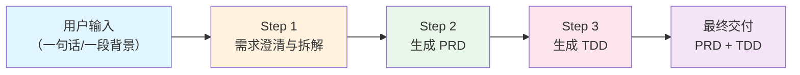

# 文档生成链式提示（Doc Generation Chain）

> 适用场景：用户仅提供一段简短的背景描述或能力需求，通过 3 步链式提示，自动生成完整的需求文档（PRD）+ 技术文档（TDD）  
> 适用模型：所有主流 LLM

---

## 流程总览



### 数据流转

```
用户输入 (自然语言)
    ↓
Step 1 输出: 结构化需求摘要 (JSON)
    ↓
Step 2 输入: 结构化需求摘要 → 输出: 完整 PRD (Markdown)
    ↓
Step 3 输入: 完整 PRD → 输出: 完整 TDD (Markdown)
```

---

## Step 1：需求澄清与拆解

### 目的
将用户的模糊描述转化为结构化的需求摘要，补全缺失信息，消除歧义。

### 提示

```
你是一名资深互联网产品顾问。用户将给你一段简短的产品/功能描述，你需要：

1. **提炼核心需求**：从描述中提取出用户真正想要实现的能力
2. **补全上下文**：基于互联网行业常识，推断并补充缺失的关键信息
3. **拆解功能模块**：将大需求拆解为可独立实现的功能模块
4. **标注不确定项**：对于你推断的内容，明确标注为「推断」

请严格按照以下 JSON 格式输出（不要输出其他内容）：

{
  "project_name": "项目/功能名称",
  "background": "项目背景（2-3 句话，包含痛点和动机）",
  "core_goal": "核心目标（一句话概括）",
  "target_users": [
    {
      "role": "用户角色名",
      "description": "角色描述",
      "core_need": "核心诉求",
      "is_inferred": false
    }
  ],
  "functional_modules": [
    {
      "module_name": "模块名称",
      "priority": "P0/P1/P2",
      "features": [
        {
          "name": "功能点名称",
          "description": "功能描述（一句话）",
          "is_inferred": false
        }
      ]
    }
  ],
  "non_functional": {
    "performance": "性能要求概述",
    "security": "安全要求概述",
    "compatibility": "兼容性要求概述"
  },
  "tech_preferences": {
    "frontend": "前端技术栈（如用户未指定则为 null）",
    "backend": "后端技术栈（如用户未指定则为 null）",
    "database": "数据库（如用户未指定则为 null）"
  },
  "open_questions": [
    {
      "question": "需要确认的问题",
      "suggestion": "建议的默认方案"
    }
  ],
  "similar_products": ["参考产品1", "参考产品2"]
}

## 推断规则

- 如果用户未指定目标用户，根据产品类型推断（ToB 产品推断管理员+普通用户，ToC 产品推断注册用户+游客）
- 如果用户未指定技术栈，设为 null，不要随意推断
- 对于互联网产品的通用能力（登录注册、权限管理、数据导出），如果场景合理，自动补充为 P2 功能并标注 is_inferred: true
- 功能模块按重要性排序，P0 在前

---

用户描述如下：

{{user_input}}
```

### 输出示例

```json
{
  "project_name": "团队协作白板",
  "background": "公司产品团队在远程协作中缺乏可视化的头脑风暴和流程梳理工具，现有工具（如 Miro）价格昂贵且数据存储在海外，不符合数据安全要求。需要一个自部署的在线白板工具。",
  "core_goal": "为产品团队提供一个支持多人实时协作的在线白板工具，支持私有化部署",
  "target_users": [
    {
      "role": "产品经理",
      "description": "使用白板进行需求梳理和流程设计",
      "core_need": "丰富的图形元素和流程图支持",
      "is_inferred": false
    },
    {
      "role": "设计师",
      "description": "使用白板进行设计评审和创意发散",
      "core_need": "自由绘制和图片导入",
      "is_inferred": true
    }
  ],
  "functional_modules": [
    {
      "module_name": "画布核心",
      "priority": "P0",
      "features": [
        {"name": "无限画布", "description": "支持无限缩放和平移的画布", "is_inferred": false},
        {"name": "基础图形", "description": "矩形、圆形、箭头、文本等基础图形绘制", "is_inferred": false},
        {"name": "自由绘制", "description": "手写笔迹绘制", "is_inferred": true}
      ]
    }
  ],
  "open_questions": [
    {
      "question": "是否需要支持移动端访问？",
      "suggestion": "MVP 阶段仅支持 Web 端，后续迭代支持移动端只读"
    }
  ]
}
```

---

## Step 2：生成 PRD

### 目的
基于 Step 1 的结构化摘要，生成完整的产品需求文档。

### 提示

```
你是一名资深互联网产品经理。以下是经过结构化整理的需求摘要（JSON 格式），请基于此生成一份完整的产品需求文档（PRD）。

## 需求摘要

{{step1_output}}

## 输出要求

请严格按照以下结构生成 Markdown 格式的 PRD 文档：

### 文档结构

1. **文档信息**：版本、日期、状态、目标读者
2. **背景与目标**
   - 项目背景：基于摘要中的 background 展开，补充行业现状和竞品分析
   - 项目目标：将 core_goal 拆解为 3-5 个 SMART 目标
   - 目标用户：基于 target_users 展开，增加使用场景描述
3. **需求概述**
   - 功能全景图：基于 functional_modules 生成表格
   - 核心流程：绘制主要业务流程（用 Mermaid 流程图）
4. **功能详细描述**：对每个功能模块展开描述
   - 功能说明（通俗语言，非技术人员可读）
   - 用户故事（作为【角色】，我希望【做什么】，以便【目的】）
   - 功能规则（编号列表，含触发条件和异常处理）
   - 界面要求（关键界面元素和交互方式）
   - 验收标准（Given-When-Then 格式）
5. **非功能性需求**：基于 non_functional 展开
6. **开放问题与风险**：基于 open_questions 展开，补充技术风险
7. **版本规划**：P0 为 v1.0，P1 为 v1.1，P2 为 v2.0
8. **附录**：术语表

### 写作规则

- 用通俗易懂的语言，确保非技术人员能看懂
- 对 is_inferred: true 的内容，在文末「开放问题」中标注为「AI 推断，待确认」
- 每个 P0 功能至少写 3 条验收标准
- 每个 P1 功能至少写 2 条验收标准
- P2 功能可以简要描述，不需要详细验收标准

现在请生成完整的 PRD 文档。
```

---

## Step 3：生成 TDD

### 目的
基于 Step 2 生成的 PRD，生成完整的技术设计文档。

### 提示

```
你是一名资深互联网技术架构师。以下是产品需求文档（PRD），请基于此生成一份完整的技术设计文档（TDD），供开发团队直接参照实施。

## PRD 内容

{{step2_output}}

## 技术栈信息

{{tech_preferences from step1_output，如果为 null 则写"由你根据需求推荐最佳技术栈"}}

## 输出要求

请严格按照以下结构生成 Markdown 格式的 TDD 文档：

### 文档结构

1. **文档信息**：版本、日期、关联 PRD、状态
2. **概述**：文档目的、需求摘要（技术语言重述）、术语定义
3. **系统架构**
   - 整体架构图（Mermaid 图）
   - 技术选型表（含版本号和选型理由，每项至少 2 条理由）
   - 服务划分（如涉及微服务）
4. **数据库设计**
   - ER 图（Mermaid erDiagram）
   - 表结构（精确到字段级别，含类型、索引、说明）
   - 索引设计（列出关键查询场景和对应索引）
5. **API 接口设计**
   - 接口总览表
   - 每个接口的详细定义（请求参数、响应参数、错误码、JSON 示例）
   - 接口遵循 RESTful 规范
6. **前端技术方案**
   - 页面结构和组件层级
   - 状态管理方案
   - 路由设计
   - 关键交互时序图
7. **后端技术方案**
   - 核心业务逻辑（伪代码）
   - 缓存策略
   - 异步处理方案
8. **安全设计**：认证授权、数据安全、接口安全
9. **性能设计**：性能目标和优化方案
10. **部署与运维**：部署架构、监控告警
11. **排期估算**：按模块估算工时
12. **风险与应对**

### 生成规则

- 覆盖 PRD 中所有 P0 和 P1 功能的技术方案
- P2 功能仅在架构层面预留扩展点，不做详细设计
- 所有表必须包含 id、created_at、updated_at、is_deleted 基础字段
- API 路径统一使用 /api/v1/ 前缀
- 对复杂业务逻辑提供伪代码
- 对每个技术决策标注备选方案

现在请生成完整的 TDD 文档。
```

---

## 端到端示例

### 用户原始输入

```
我想做一个内部工单系统，员工可以提交 IT 问题、报修等工单，
IT 部门可以接单处理。
```

### Step 1 输出（结构化摘要）

```json
{
  "project_name": "内部 IT 工单系统",
  "background": "公司内部员工遇到 IT 问题（电脑故障、网络异常、软件安装等）时，目前通过微信群或邮件联系 IT 部门，沟通效率低、问题追踪困难、处理进度不透明。需要一个标准化的工单系统来规范 IT 服务流程。",
  "core_goal": "建立标准化的 IT 服务请求和处理流程，提升 IT 响应效率，实现问题全生命周期追踪",
  "target_users": [
    {"role": "普通员工", "description": "提交 IT 问题和报修请求的公司员工", "core_need": "快速提交问题，实时查看处理进度", "is_inferred": false},
    {"role": "IT 工程师", "description": "负责处理工单的 IT 部门技术人员", "core_need": "高效接单、分类处理、记录解决方案", "is_inferred": false},
    {"role": "IT 主管", "description": "管理 IT 团队和服务质量的负责人", "core_need": "工单统计、绩效分析、SLA 监控", "is_inferred": true}
  ],
  "functional_modules": [
    {
      "module_name": "工单管理",
      "priority": "P0",
      "features": [
        {"name": "创建工单", "description": "员工填写问题描述、分类、紧急程度并提交工单", "is_inferred": false},
        {"name": "工单列表", "description": "按状态、时间、分类查看和筛选工单", "is_inferred": false},
        {"name": "工单详情", "description": "查看工单完整信息、处理记录和沟通历史", "is_inferred": false},
        {"name": "工单流转", "description": "接单、转派、挂起、完成等状态流转", "is_inferred": false}
      ]
    },
    {
      "module_name": "沟通协作",
      "priority": "P1",
      "features": [
        {"name": "工单评论", "description": "在工单中进行沟通和补充信息", "is_inferred": true},
        {"name": "消息通知", "description": "工单状态变更时通知相关人员", "is_inferred": true}
      ]
    },
    {
      "module_name": "数据统计",
      "priority": "P2",
      "features": [
        {"name": "工单统计", "description": "按时间、分类、处理人统计工单数据", "is_inferred": true},
        {"name": "SLA 监控", "description": "监控工单响应时间和解决时间是否达标", "is_inferred": true}
      ]
    }
  ],
  "open_questions": [
    {"question": "是否需要与企业微信/钉钉/飞书集成？", "suggestion": "建议 v1.1 集成企业微信通知"},
    {"question": "工单分类体系如何定义？", "suggestion": "建议初始分类：硬件故障、软件问题、网络问题、账号权限、其他"}
  ]
}
```

### Step 2 输出 → 完整 PRD（参见 prd-generator.md 模板的输出格式）

### Step 3 输出 → 完整 TDD（参见 tdd-generator.md 模板的输出格式）

---

## 使用方式

### 方式一：手动三步执行

1. 将 Step 1 提示复制到 LLM，替换 `{{user_input}}` 为你的描述，获取 JSON 输出
2. 将 Step 2 提示复制到 LLM，替换 `{{step1_output}}` 为上一步的 JSON，获取 PRD
3. 将 Step 3 提示复制到 LLM，替换 `{{step2_output}}` 为上一步的 PRD，获取 TDD

### 方式二：单次对话执行

在支持长上下文的模型中（Claude/GPT-4），可以在一次对话中依次执行三步：

```
请按以下三步为我生成文档：

第一步：分析我的需求并输出结构化摘要（JSON）
第二步：基于摘要生成完整的 PRD
第三步：基于 PRD 生成完整的 TDD

我的需求：{{你的描述}}

请从第一步开始。
```

### 方式三：使用主控提示（推荐）

参见 `master-prompt.md`，一个提示搞定一切。
