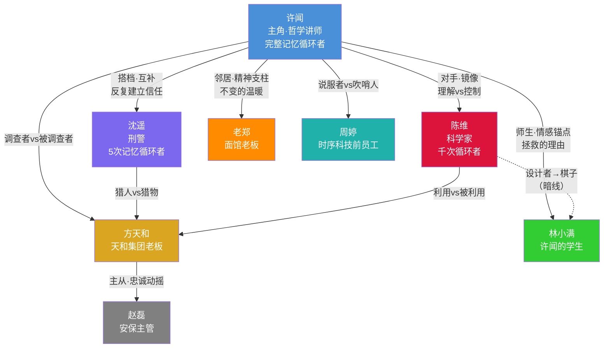

# 关系网络

---

## 一、关系矩阵

```json
{
  "relationships": [
    {
      "from": "C001（许闻）",
      "to": "C002（沈遥）",
      "type": "搭档/互补",
      "description": "理性哲学家与务实刑警的碰撞组合",
      "tension": "许闻话多、爱分析，沈遥只要结果；许闻有完整记忆，沈遥每5次循环就会'重置'——信任需要反复建立",
      "surface_vs_truth": "表面是互相看不顺眼的临时搭档，实际是循环中唯一能互相理解的人",
      "evolution": [
        {"chapter_range": "1-35", "state": "陌生人→许闻单方面注意到她的异常行为"},
        {"chapter_range": "36-50", "state": "互相试探→被迫合作（沈遥每次重置后许闻都要重新说服她）"},
        {"chapter_range": "51-110", "state": "信任建立→默契搭档（许闻开发出一套'快速说服沈遥'的方法）"},
        {"chapter_range": "111-167", "state": "生死之交→互相托付（最终决战中的核心搭档）"}
      ]
    },
    {
      "from": "C001（许闻）",
      "to": "C003（陈维）",
      "type": "对手/镜像",
      "description": "两个用不同方式对抗时间的人——许闻想理解循环，陈维想控制循环",
      "tension": "陈维选中许闻作为'变量'，但许闻的行为超出了他的预期；两人都是INTX型理性思维者，但许闻保留了人性，陈维几乎失去了",
      "surface_vs_truth": "表面是'侦探vs幕后黑手'的对立，实际是'还有希望的人vs已经绝望的人'的对照",
      "evolution": [
        {"chapter_range": "1-14", "state": "许闻不知道陈维的存在"},
        {"chapter_range": "15-70", "state": "许闻追查'失踪科学家'的线索，陈维在暗中观察许闻"},
        {"chapter_range": "71-110", "state": "正面对峙→博弈→许闻理解了陈维的动机但不认同他的方法"},
        {"chapter_range": "111-167", "state": "最终对决→许闻用陈维想不到的方式解决了问题→陈维选择放手"}
      ]
    },
    {
      "from": "C001（许闻）",
      "to": "C005（林小满）",
      "type": "师生/情感锚点",
      "description": "许闻进入循环的情感驱动力",
      "tension": "许闻一开始只是想救一个学生，但随着循环深入，他开始反思自己为什么从来没有认真对待过这个学生",
      "surface_vs_truth": "表面是普通的师生关系，实际上林小满代表了许闻'失去的热情'——他曾经也是这样对世界充满好奇的人",
      "evolution": [
        {"chapter_range": "1-5", "state": "普通师生→许闻目睹林小满死于爆炸"},
        {"chapter_range": "6-35", "state": "许闻反复尝试救林小满→每次失败→从'救一个人'变成'必须查明真相'"},
        {"chapter_range": "36-110", "state": "许闻在不同循环中与林小满深度交流→发现这个学生比他以为的更有深度"},
        {"chapter_range": "111-167", "state": "林小满成为最终计划的关键一环——不是被拯救的对象，而是主动参与者"}
      ]
    },
    {
      "from": "C001（许闻）",
      "to": "C006（老郑）",
      "type": "邻居/精神支柱",
      "description": "循环中唯一不变的温暖——每天7:05的擀面声",
      "tension": "许闻越来越依赖老郑的'不变'来维持自己的心理稳定，但这种依赖本身是脆弱的",
      "surface_vs_truth": "表面是房东和租客的随意关系，实际上老郑是许闻在循环中的'心理锚点'",
      "evolution": [
        {"chapter_range": "1-20", "state": "普通邻居→许闻开始刻意在每次循环开始时去吃面（仪式感）"},
        {"chapter_range": "21-70", "state": "许闻在某次崩溃的循环中对老郑倾诉→老郑虽然不理解但给了朴素的安慰"},
        {"chapter_range": "71-110", "state": "许闻发现'观察者效应'在老郑身上最明显→开始研究原因"},
        {"chapter_range": "111-167", "state": "老郑的一句话成为破局关键→循环结束后许闻第一件事是去吃面"}
      ]
    },
    {
      "from": "C001（许闻）",
      "to": "C004（方天和）",
      "type": "调查者/被调查者",
      "description": "许闻追查爆炸真相的过程中，方天和是最大的障碍",
      "tension": "方天和有权有势，许闻只有循环给他的信息优势——但信息优势在面对权力时不一定够用",
      "surface_vs_truth": "表面是'正义vs邪恶'，实际上方天和不是爆炸的制造者，他只是在掩盖另一个秘密",
      "evolution": [
        {"chapter_range": "1-7", "state": "许闻不知道方天和是谁"},
        {"chapter_range": "8-35", "state": "许闻开始调查天和集团→多次被赵磊阻拦"},
        {"chapter_range": "36-70", "state": "许闻和沈遥联手对付方天和→发现他不是爆炸的主谋"},
        {"chapter_range": "71-167", "state": "方天和从障碍变成不稳定的盟友→最终提供关键信息"}
      ]
    },
    {
      "from": "C002（沈遥）",
      "to": "C004（方天和）",
      "type": "猎人/猎物",
      "description": "沈遥在循环前就在调查方天和",
      "tension": "沈遥的记忆限制让她每5次循环就要重新建立对方天和的调查认知",
      "surface_vs_truth": "表面是刑警调查嫌疑人，实际上沈遥的调查触及了方天和最核心的秘密",
      "evolution": [
        {"chapter_range": "1-35", "state": "沈遥在循环中独自调查方天和（许闻不知道）"},
        {"chapter_range": "36-70", "state": "与许闻合作后调查效率大幅提升"},
        {"chapter_range": "71-110", "state": "发现方天和与陈维的关系"},
        {"chapter_range": "111-167", "state": "最终对决中沈遥负责'现实层面'的行动——控制方天和"}
      ]
    },
    {
      "from": "C003（陈维）",
      "to": "C004（方天和）",
      "type": "利用/被利用",
      "description": "陈维利用方天和的资金进行实验，方天和以为自己在投资未来科技",
      "tension": "方天和发现被利用后的愤怒，vs 陈维对方天和的彻底蔑视",
      "surface_vs_truth": "表面是投资人和科学家的合作关系，实际是两个互相利用的人",
      "evolution": [
        {"chapter_range": "背景", "state": "陈维说服方天和投资时序科技"},
        {"chapter_range": "71-110", "state": "方天和发现陈维还活着且在操控循环→试图夺回控制权"},
        {"chapter_range": "111-167", "state": "三方博弈中方天和成为不确定因素"}
      ]
    },
    {
      "from": "C003（陈维）",
      "to": "C005（林小满）",
      "type": "设计者/棋子",
      "description": "林小满去天和大厦面试是陈维安排的——他需要许闻有一个'必须拯救的人'来驱动许闻行动",
      "tension": "陈维把林小满当作工具，但许闻把林小满当作人",
      "surface_vs_truth": "表面上林小满是随机的爆炸受害者，实际上他被选中是有原因的",
      "evolution": [
        {"chapter_range": "1-70", "state": "许闻不知道林小满去面试是被安排的"},
        {"chapter_range": "71-110", "state": "许闻发现真相→对陈维的愤怒达到顶点"},
        {"chapter_range": "111-167", "state": "这个真相成为许闻和陈维最终对决的情感核心"}
      ]
    },
    {
      "from": "C004（方天和）",
      "to": "C007（赵磊）",
      "type": "主从/忠诚动摇",
      "description": "赵磊是方天和最信任的人，但信任正在被消耗",
      "tension": "赵磊发现方天和可能与爆炸有关，忠诚vs良知的冲突",
      "surface_vs_truth": "表面是绝对忠诚的主从关系，实际上赵磊一直在暗中保留证据",
      "evolution": [
        {"chapter_range": "1-35", "state": "绝对忠诚，执行一切命令"},
        {"chapter_range": "36-70", "state": "开始怀疑，但还在执行"},
        {"chapter_range": "71-110", "state": "内心挣扎加剧"},
        {"chapter_range": "111-167", "state": "在关键时刻倒戈，提供关键证据"}
      ]
    },
    {
      "from": "C001（许闻）",
      "to": "C008（周婷）",
      "type": "说服者/吹哨人",
      "description": "许闻需要周婷的技术信息来理解循环，但每次循环都要重新找到她、重新说服她",
      "tension": "周婷极度恐惧，每次说服都是一场心理博弈",
      "surface_vs_truth": "表面是信息交换关系，实际上许闻在循环中逐渐理解了周婷的恐惧和愧疚",
      "evolution": [
        {"chapter_range": "10-35", "state": "许闻找到周婷→多次循环中尝试不同方式说服她"},
        {"chapter_range": "36-70", "state": "找到最有效的说服方式→获取关键技术信息"},
        {"chapter_range": "71-110", "state": "周婷提供了打开加密文档的线索"},
        {"chapter_range": "111-167", "state": "周婷在最终计划中提供远程技术支持"}
      ]
    }
  ],

  "factions": [
    {
      "name": "循环者阵营",
      "members": ["C001（许闻）", "C002（沈遥）", "C003（陈维）"],
      "goal": "各自不同——许闻要打破循环并拯救所有人，沈遥要查明真相，陈维要拯救女儿",
      "rival_faction": "彼此之间既合作又对立",
      "internal_tension": "三人的目标看似相似实则冲突——打破循环可能意味着爆炸真实发生（许闻vs陈维的核心矛盾）"
    },
    {
      "name": "天和集团",
      "members": ["C004（方天和）", "C007（赵磊）"],
      "goal": "掩盖真相，保护集团利益",
      "rival_faction": "循环者阵营",
      "internal_tension": "赵磊的忠诚正在动摇"
    },
    {
      "name": "真相追寻者",
      "members": ["C001（许闻）", "C002（沈遥）", "C008（周婷）"],
      "goal": "查明爆炸真相和循环的本质",
      "rival_faction": "天和集团 + 陈维",
      "internal_tension": "周婷的恐惧可能导致她在关键时刻退缩"
    }
  ],

  "love_lines": [
    {
      "participants": ["C001（许闻）", "C002（沈遥）"],
      "type": "暗线/慢热",
      "development": "不是传统的爱情线，而是在极端环境下产生的深度理解和依赖。许闻每次循环都要重新说服沈遥信任他，这个过程本身就是一种独特的'告白'——他比任何人都了解她，但她每5次循环就会忘记他",
      "key_moments": [
        "第一次合作时沈遥说'你怎么知道我喜欢喝美式'（许闻已经循环了很多次）",
        "某次循环中沈遥即将重置，对许闻说'下次见面，帮我记住今天'",
        "最终决战前，许闻告诉沈遥：'如果我失去记忆，你要帮我记住——我叫许闻，我是个话太多的哲学老师，我认识一个只会说两个字的刑警'"
      ]
    }
  ],

  "rivalry_chains": [
    {
      "description": "许闻的对手升级链",
      "chain": [
        "赵磊（Lv1·物理阻碍）→ 方天和（Lv2·权力阻碍）→ 陈维（Lv3·认知阻碍）→ 循环本身（Lv4·规则阻碍）"
      ],
      "escalation": "从'打不过的保安'到'斗不过的首富'到'算不过的天才'到'破不了的规则'——每一级对手的维度都在升级"
    }
  ]
}
```

---

## 二、关系网络文字描述

### 核心三角：许闻 - 沈遥 - 陈维

故事的核心是三个循环者之间的博弈。**许闻**是"新手循环者"，拥有完整记忆但循环次数最少，他的优势是"新鲜视角"——能看到陈维因为循环太久而忽略的东西。**沈遥**是"受限循环者"，记忆只保留5次，她的优势是"刑侦专业能力"和"每次重置后的新鲜判断力"。**陈维**是"老牌循环者"，循环上千次几乎全知，但他的劣势是"失去了人性中不可预测的部分"。

三人的目标看似一致（都想解决爆炸问题），实则冲突：
- 许闻要**打破循环+拯救所有人**
- 沈遥要**查明真相+伸张正义**
- 陈维要**保持循环直到找到救女儿的方法**

### 权力线：方天和 - 赵磊 - 周婷

方天和是"现实世界的权力中心"，他不在循环中，但他的权力在每次循环的这一天里都是真实的威胁。赵磊是他的执行者，但忠诚正在裂变。周婷是逃离了这个权力体系的"叛逃者"，掌握着关键信息。

### 情感线：许闻 - 林小满 - 老郑

林小满是许闻行动的"情感驱动力"——每次循环看着这个阳光的学生走向死亡，是许闻坚持下去的原因。老郑是许闻的"心理锚点"——无论循环多少次，7:05的擀面声是唯一不变的温暖。这两个非循环者角色，代表了"值得被拯救的日常"。

---

## 三、Mermaid 关系图


