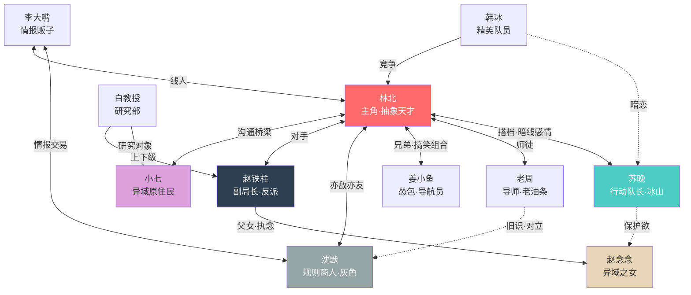

# 关系网络

## 关系矩阵

```json
{
  "relationships": [
    {
      "from": "C001（林北）",
      "to": "C002（苏晚）",
      "type": "搭档/暗线感情",
      "description": "最强大脑+最强执行力的黄金搭档",
      "tension": "林北的抽象让苏晚抓狂，但他的思路总能在关键时刻救命",
      "surface_vs_truth": "表面互相嫌弃（苏晚嫌他不正经，林北嫌她太死板）→ 实际上是最信任彼此的人",
      "evolution": [
        {"chapter_range": "1-50", "state": "上司与下属，苏晚觉得林北是个不靠谱的疯子"},
        {"chapter_range": "51-110", "state": "逐渐认可，苏晚开始理解林北的'抽象'背后是天才"},
        {"chapter_range": "111-180", "state": "默契搭档，无需言语就能配合"},
        {"chapter_range": "181-260", "state": "互相信任到可以把命交给对方"},
        {"chapter_range": "261-450", "state": "感情明确但都不说破，用行动表达"}
      ]
    },
    {
      "from": "C001（林北）",
      "to": "C003（老周）",
      "type": "师徒",
      "description": "老周是林北在管理局的引路人",
      "tension": "老周的经验主义vs林北的天马行空",
      "evolution": [
        {"chapter_range": "1-50", "state": "老周觉得这小子脑子有问题但运气好"},
        {"chapter_range": "51-180", "state": "逐渐认可林北的能力，开始认真传授经验"},
        {"chapter_range": "181-340", "state": "亦师亦友，老周把林北当自己孩子看"},
        {"chapter_range": "341-450", "state": "老周退居二线，林北独当一面"}
      ]
    },
    {
      "from": "C001（林北）",
      "to": "C004（姜小鱼）",
      "type": "兄弟/搭档",
      "description": "抽象哥和怂包的爆笑组合",
      "tension": "姜小鱼崇拜林北但经常被林北的操作吓到",
      "evolution": [
        {"chapter_range": "1-50", "state": "林北救了姜小鱼，小鱼开始跟班"},
        {"chapter_range": "51-180", "state": "搞笑二人组，小鱼是林北的'翻译官'（把林北的抽象话翻译成人话）"},
        {"chapter_range": "181-340", "state": "真正的战友，小鱼开始独当一面"},
        {"chapter_range": "341-450", "state": "并肩作战的兄弟"}
      ]
    },
    {
      "from": "C001（林北）",
      "to": "C005（沈默）",
      "type": "亦敌亦友",
      "description": "理性到极致的商人vs感性到抽象的穿越者",
      "tension": "沈默无法理解林北为什么会做'不划算'的事，林北无法理解沈默为什么把一切都当交易",
      "surface_vs_truth": "表面是利益交换关系 → 实际上沈默被林北的'非理性'深深吸引",
      "evolution": [
        {"chapter_range": "15-50", "state": "纯粹的交易关系，互相利用"},
        {"chapter_range": "51-180", "state": "多次合作后产生微妙的信任"},
        {"chapter_range": "181-260", "state": "沈默第一次做了'不划算'的事来帮林北"},
        {"chapter_range": "261-450", "state": "真正的同伴，沈默学会了'不是所有事都需要回报'"}
      ]
    },
    {
      "from": "C001（林北）",
      "to": "C006（赵铁柱）",
      "type": "对手",
      "description": "主角vs主要反派，但反派有令人同情的动机",
      "tension": "两人都想保护重要的人，但方式截然不同",
      "evolution": [
        {"chapter_range": "20-110", "state": "上下级关系，赵铁柱暗中观察林北"},
        {"chapter_range": "111-180", "state": "赵铁柱开始利用林北的能力"},
        {"chapter_range": "181-260", "state": "身份暴露，正面对抗"},
        {"chapter_range": "261-410", "state": "从对抗到理解，最终联手"}
      ]
    },
    {
      "from": "C002（苏晚）",
      "to": "C007（赵念念）",
      "type": "镜像关系",
      "description": "苏晚在念念身上看到了自己弟弟的影子",
      "tension": "苏晚想救念念，但念念的情况和她弟弟不同",
      "evolution": [
        {"chapter_range": "120-180", "state": "苏晚对念念产生保护欲"},
        {"chapter_range": "181-340", "state": "通过念念逐渐接受弟弟可能回不来的事实"},
        {"chapter_range": "341-450", "state": "把念念当作妹妹看待"}
      ]
    },
    {
      "from": "C006（赵铁柱）",
      "to": "C007（赵念念）",
      "type": "父女",
      "description": "全书最催泪的关系线——一个父亲为救女儿走上歧途",
      "tension": "念念知道父亲在做什么，但不知道该怎么阻止",
      "evolution": [
        {"chapter_range": "1-180", "state": "赵铁柱暗中为女儿做一切"},
        {"chapter_range": "181-340", "state": "父女重逢但无法回到从前"},
        {"chapter_range": "341-450", "state": "父女和解，赵铁柱学会放手"}
      ]
    },
    {
      "from": "C003（老周）",
      "to": "C005（沈默）",
      "type": "旧识/对立",
      "description": "两人都是'黑色星期五'的幸存者，但走上了完全不同的路",
      "tension": "老周选择了保护人类，沈默选择了利用规则",
      "surface_vs_truth": "表面互相看不顺眼 → 实际上是唯一能理解彼此创伤的人"
    },
    {
      "from": "C010（韩冰）",
      "to": "C001（林北）",
      "type": "竞争/从敌到友",
      "description": "正统精英vs野路子天才",
      "tension": "韩冰看不惯林北的不正经，但不得不承认他的能力",
      "evolution": [
        {"chapter_range": "30-110", "state": "敌意，觉得林北不配待在管理局"},
        {"chapter_range": "111-260", "state": "在异域中被林北救过后开始改观"},
        {"chapter_range": "261-450", "state": "虽然嘴上不服但已经认可，成为可靠的战友"}
      ]
    },
    {
      "from": "C010（韩冰）",
      "to": "C002（苏晚）",
      "type": "暗恋（单箭头）",
      "description": "韩冰暗恋苏晚但从不表达",
      "tension": "看到苏晚和林北越来越默契，韩冰的心态变化",
      "evolution": [
        {"chapter_range": "30-180", "state": "默默守护，把对林北的敌意部分投射为嫉妒"},
        {"chapter_range": "181-340", "state": "逐渐释然，把感情转化为对苏晚的祝福"},
        {"chapter_range": "341-450", "state": "找到自己的方向，不再执着"}
      ]
    }
  ],

  "factions": [
    {
      "name": "怪谈管理局·行动部",
      "members": ["C001", "C002", "C003", "C004", "C010"],
      "goal": "监控和清除异域，保护普通人",
      "rival_faction": "规则猎人（部分）",
      "internal_tension": "行动部和研究部的理念冲突——行动部要消灭异域，研究部想研究异域"
    },
    {
      "name": "怪谈管理局·高层",
      "members": ["C006", "C009"],
      "goal": "管控异域局势（但赵铁柱有私心）",
      "rival_faction": "无",
      "internal_tension": "赵铁柱的秘密行动vs白教授的纯粹研究"
    },
    {
      "name": "灰色地带",
      "members": ["C005", "C008"],
      "goal": "各取所需——沈默要规则，李大嘴要情报",
      "rival_faction": "与管理局和规则猎人都有交集",
      "internal_tension": "沈默的冷血理性vs李大嘴的热血好奇"
    },
    {
      "name": "异域存在",
      "members": ["C007", "C011"],
      "goal": "理解人类/回归人类",
      "rival_faction": "无明确对立",
      "internal_tension": "念念保留了人类情感，小七则是纯粹的异域存在"
    }
  ],

  "love_lines": [
    {
      "participants": ["C001（林北）", "C002（苏晚）"],
      "type": "双强·慢热",
      "development": "从互相嫌弃到默契搭档到互相信任到心照不宣。不会有大段的恋爱戏，而是在生死之间自然产生的感情",
      "key_moments": [
        "苏晚第一次说'我听懂你的意思了'（第40章左右）",
        "林北在异域中不顾一切救苏晚（第95章左右）",
        "苏晚在林北被陷害时选择相信他（第200章左右）",
        "两人在最终决战前的对话——不说'我爱你'，说'活着回来'（第380章左右）"
      ]
    }
  ],

  "rivalry_chains": [
    {
      "description": "对手升级链",
      "chain": [
        "E级异域怪物（Lv1，第1卷）",
        "规则猎人中的叛徒（Lv2，第2卷）",
        "B级异域+异域居民（Lv3，第3卷）",
        "赵铁柱/改写者（Lv4，第4卷）",
        "异域之心的意识（Lv5，第5-6卷）",
        "终极元规则（最终BOSS，第6-7卷）"
      ],
      "escalation": "从具体的怪物 → 人类反派 → 抽象的规则本身，对手从'可以打败的'变成'需要理解的'"
    }
  ]
}
```

## 关系网络文字描述

### 核心关系网

**林北**是整个关系网的中心，他的"抽象"特质像一块石头投入平静的水面，激起了所有人的变化：

- **林北 ↔ 苏晚**：全书最核心的关系线。一个抽象到没人听得懂，一个严谨到不近人情。但恰恰是苏晚的逻辑能力让她成为唯一能"翻译"林北思维的人，而林北的跳脱思维也是苏晚最需要的——她太依赖经验和逻辑，面对超出认知的异域时需要林北的"跳出框架"。两人的感情线是暗线，不会喧宾夺主，但每一个关键时刻都会让读者感受到他们之间的羁绊。

- **林北 ↔ 姜小鱼**：全书最搞笑的组合。小鱼是林北的"人话翻译器"——林北说出一段谁都听不懂的话，小鱼会说"北哥的意思是……"。同时小鱼也是读者的代入视角——他的恐惧和吐槽代表了普通人面对异域的真实反应。

- **林北 ↔ 沈默**：全书最有张力的关系。极端感性vs极端理性，两人的每次对话都是思维碰撞。沈默是林北的"暗面镜像"——如果林北没有穿越带来的乐观和善良，他可能就会变成沈默。

- **林北 ↔ 赵铁柱**：全书最复杂的对抗。赵铁柱不是纯粹的恶人，他的动机（救女儿）甚至让人同情。林北需要阻止他，但也理解他。最终的解决方式不是"打败"而是"说服"。

### 暗线关系

- **老周 ↔ 沈默**：两人都是"黑色星期五"的幸存者，但那次事件让他们走上了完全不同的路。老周选择了守护，沈默选择了利用。这条暗线会在第4卷揭开。
- **赵铁柱 ↔ 赵念念**：父女线是全书的催泪担当。一个父亲为了救女儿不惜成为反派，而女儿其实一直知道父亲在做什么。

## Mermaid 关系图


